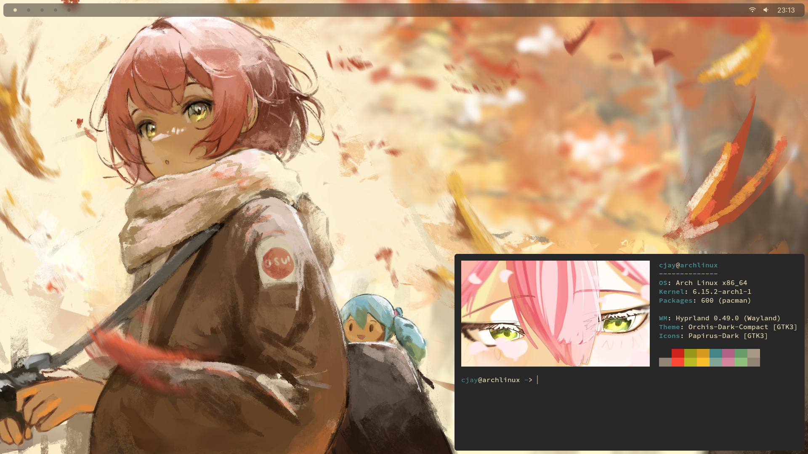

# Dotfiles

Dotfiles for a simple Arch Linux Hyprland setup.

**System**  
- **Shell:** `bash`  
- **Terminal Emulator:** `kitty`  
- **System Information:** `fastfetch`  
- **System Monitor:** `bottom`  
- **Browser:** `firefox`  

**Utilities**  
- **Status Bar:** `waybar`  
- **Wallpaper Utility:** `hyprpaper`  
- **Application Launcher:** `rofi-wayland`  
- **Screenshotting:** `grim` `slurp` `wl-clipboard`  

**Appearance**  
- **GTK Theme:** `orchis-theme`  
- **Icon Theme:** `papirus-icon-theme`  
- **Cursor Theme:** `capitaine-cursors`  

**Extras**  
- **Wallpaper:** From the [osu! Midnight Moment Art Contest](https://osu.ppy.sh/community/contests/226) by [tehfire](https://osu.ppy.sh/users/7082924)  
- **Fastfetch Logo:** From the [osu! Spring 2024 Fanart Contest](https://osu.ppy.sh/community/contests/205) by [roadcrow__](https://osu.ppy.sh/users/11752694)  

**Optional**  
- **Game:** osu!(lazer)

## Installation

1. Install a base Arch Linux system using [arch-install-script](https://github.com/CjayDoesCode/arch-install-script).

2. Download the script.
```bash
curl -o install.sh https://raw.githubusercontent.com/CjayDoesCode/dotfiles/main/install.sh
```

3. Add executable permissions.
```bash
chmod +x install.sh
```

4. Run the script.
```bash
./install.sh
```

## Installed Packages

| Package Group       | Packages                                                                                                                                                                                       |
| :------------------ | :--------------------------------------------------------------------------------------------------------------------------------------------------------------------------------------------- |
| `packages`          | `bottom` `chezmoi` `fastfetch` `firefox` `grim` `helix` `imagemagick` `kitty` `rofi-wayland` `slurp` `udiskie` `uwsm` `waybar` `wl-clipboard` `xdg-desktop-portal-gtk` `xdg-user-dirs`         |
| `hyprland_packages` | `hyprland` `hyprpaper` `hyprpolkitagent` `xdg-desktop-portal-hyprland`                                                                                                                         |
| `font_packages`     | `adobe-source-code-pro-fonts` `inter-font` `noto-fonts` `noto-fonts-cjk` `noto-fonts-emoji` `noto-fonts-extra` `ttf-nerd-fonts-symbols` `ttf-nerd-fonts-symbols-mono` `ttf-sourcecodepro-nerd` |
| `theme_packages`    | `capitaine-cursors` `orchis-theme` `papirus-icon-theme`                                                                                                                                        |
