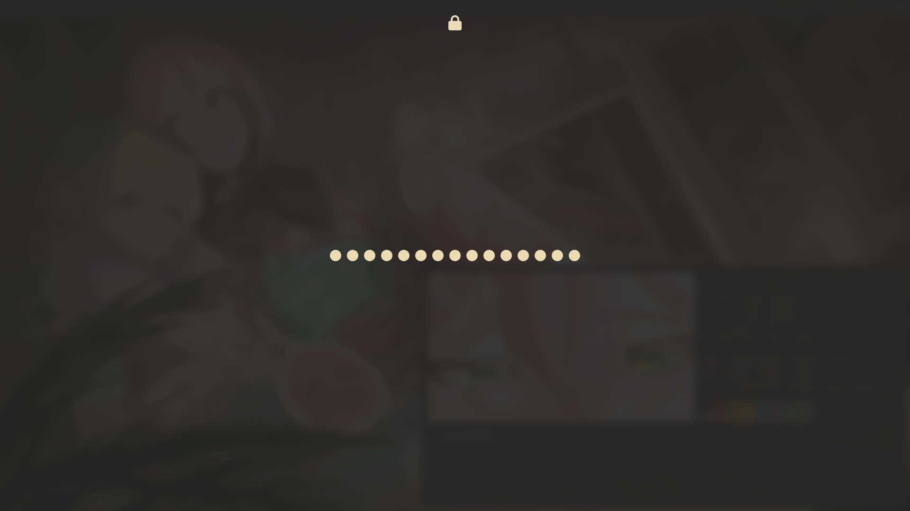

# Dotfiles

Dotfiles for an Arch Linux Hyprland setup.

**Applications**

- **NetworkManager Connection Editor:** nm-connection-editor
- **PulseAudio Volume Control:** pavucontrol
- **Terminal Emulator:** kitty
- **Web Browser:** firefox

**User Interface**

- **Application Launcher:** rofi
- **Screen Lock:** hyprlock
- **Status Bar:** waybar
- **Wallpaper Utility:** hyprpaper

**Utilities**

- **Idle Management Daemon:** hypridle
- **Notification Daemon:** mako
- **System Information:** fastfetch
- **System Monitor:** bottom

**Appearance**

- **Cursor Theme:** capitaine-cursors
- **GTK Theme:** orchis-theme
- **Icon Theme:** tela-circle-icon-theme-standard

**Extras**

- **Fastfetch Logo:** From [osu! Spring 2024 Fanart Contest](https://osu.ppy.sh/community/contests/205) by [Bitiksquid (formerly roadcrow__)](https://osu.ppy.sh/users/11752694)
- **Wallpaper:** From [osu! Midnight Moment Art Contest](https://osu.ppy.sh/community/contests/226) by [tehfire](https://osu.ppy.sh/users/7082924)

**Optional**

- **Tablet Driver:** OpenTabletDriver
- **Rhythm Game :** osu!(lazer)

## Installation

1. Install a base Arch Linux system by following the [ArchWiki Installation Guide](https://wiki.archlinux.org/title/Installation_guide) or using [arch-install-scripts](https://github.com/CjayDoesCode/arch-install-scripts).

2. Download the script.
```bash
curl -O https://raw.githubusercontent.com/CjayDoesCode/dotfiles/main/install.sh
```

3. Make the script executable.
```bash
chmod +x install.sh
```

4. Run the installer.
```bash
./install.sh
```

## Installed Packages

| Package Group       | Packages                                                                                                                                                                                                                                  |
| :---                | :---                                                                                                                                                                                                                                      |
| base_packages       | bottom, chezmoi, fastfetch, greetd, greetd-tuigreet, grim, helix, imagemagick, kitty, libnotify, mako, nm-connection-editor, pavucontrol, rofi-wayland, slurp, udiskie, uwsm, waybar, wl-clipboard, xdg-desktop-portal-gtk, xdg-user-dirs |
| font_packages       | inter-font, noto-fonts, noto-fonts-cjk, noto-fonts-emoji, noto-fonts-extra, ttf-nerd-fonts-symbols, ttf-nerd-fonts-symbols-mono, ttf-sourcecodepro-nerd                                                                                   |
| hyprland_packages   | hypridle, hyprland, hyprlock, hyprpaper, hyprpolkitagent, xdg-desktop-portal-hyprland                                                                                                                                                     |
| theme_packages      | capitaine-cursors, orchis-theme, tela-circle-icon-theme-standard                                                                                                                                                                          |
| osu_packages        | osu-mime, osu-handler, osu-lazer-bin                                                                                                                                                                                                      |
| otd_package         | opentabletdriver                                                                                                                                                                                                                          |
| browser_package[^1] | firefox                                                                                                                                                                                                                                   |

[^1]: You can replace the browser package with the --browser option (e.g., `./install.sh --browser qutebrowser`).
